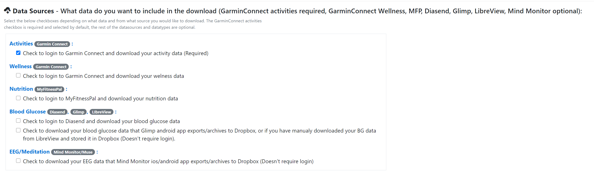
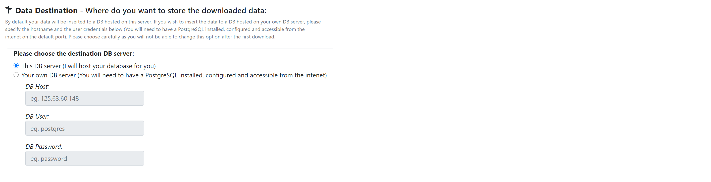
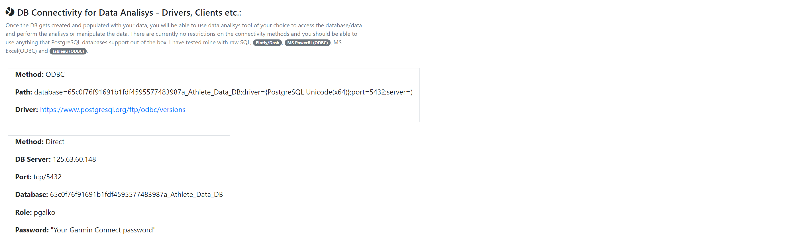
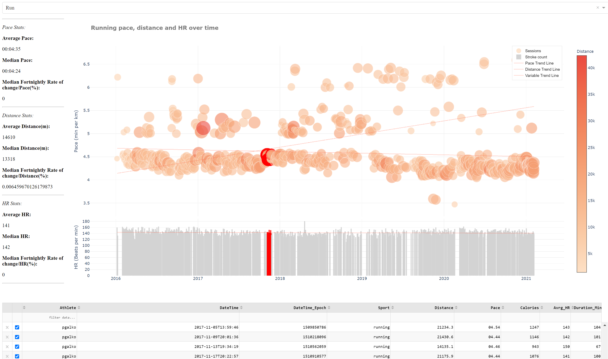
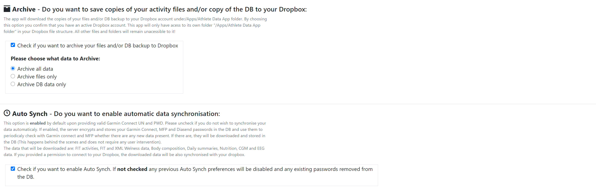
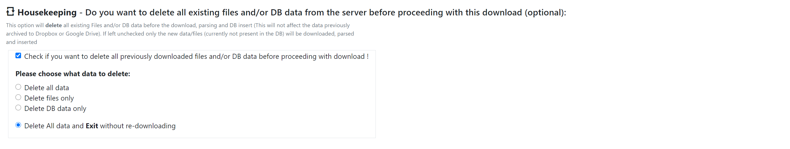

# athlete_data_warehouse

## What does it do ?
This is an experimental tool that allows you to download all historical activities from Garmin Connect and daily wellness data like weight, continuous HR, HRV, body temperature, stress, sleep etc from Garmin Connect and Oura. Nutrition data from MyFittnessPal, blood glucose data from Diasend, Glimp or LibreView and EEG/meditation data from muse headband via Mind Monitor app and historical weather observations from Meteostat service. In addition to this, it can automaticaly synchronise with the above services daily and download and save any new data. Data is downloaded in either FIT,XML,JSON or CSV files that then get parsed,cleaned,formated and inserted in to the users's PostgreSQL database for future analysis by the user. And optionaly archived in the original export format to Dropbox. A live and fully functional service can be explored here: https://athletedata.net.

## Who is it for:
There is a few alternative usage scenarios.
1. It can be setup and used privately by individuals who want to consolidate their excersize and health records in one place for analysis, research or privacy reasons (could be setup on Windows ,Mac OS ar UNIX workstation or a local or cloud based server).
2. It can be published from a web server (Apache/Mod-WSGI/Flask/PostgreSQL) and provided to independent users as a data collection and warehousing service (see an example here: https://athletedata.net).
3. It can be used by researches to collect and consolidate participant's historical and current health and excersize data to present to machine learning models or for direct analisys or visualizations.

## What data from what sources ?
* **Garmin Connect** - Activity/Exercise data in FIT and TCX formats.
* **Garmin Connect** - Wellness/Health data in FIT and XML formats.
* **OuraRing** - Sleep, HRV, Body Temperature data retrieved via API
* **MyFitnessPal** - Daily nutrition data (Calories,Food items,Units,Macro nutrients).
* **Diasend** - Blood Glucose data from continuous blood glucose monitors in XLS format.
* **Glimp** - Blood Glucose data collected via Glimp android app and stored in Dropbox.
* **LibreView** - Blood Glucose data manually exported from LibreView website and stored in Dropbox.
* **Mind Monitor** - EEG data from Muse devices collected via Mind Monitor ios/android app and stored in Dropbox.
* **Meteostat** - Current and historical weather observations

## How is the user data accessed and downloaded ?
The tool's front end runs on an Apache web-server using Flask and Python in the background (Can optionally be run using Flask inbuilt web server). The process starts with user selecting the data sources and the types of data that he would like to download. He will then provide login credentials for the selected data sources. Next the user chooses from available options like destination DB server, date ranges, archiving of the original files, clearing of previously downloaded data, enabling periodic autosynch etc. The user will be required to specify the date ranges (or at lest the start date) before the download can proceed. If the option to download Glimp or LibreView BG data is selected, the user will have to first share the Glimp or LibreView archive folder located in his Dropbox and input the generated link to the Glimp/LibreView download section. Similar procedure applies if user wants to download Mind Monitor EEG data. Finally user would submit the completed request to the download service and wait for the download to complete. The download service is a type of web-scraper using the supplied credentials to log in to the user's account. Once logged in, it browses to download pages and iterates through available downloads. Finally it downloads the retrieved data to the server in the FIT,XML or CSV formats.

*Select Datasouces:*


## Where and How is the user data stored ?
The user data files are first downloaded and stored to the webserver's file system as flat files as described above. After each of the files is successfully downloaded and saved, the service parses and cleans the content which then gets formated and inserted in to the PostgreSQL database hosted either on this server or on the user's own DB server (the user will need to provide hostname/IP address, username, password). If user chooses to store his data on this DB server he will have his own database that he has got full and unrestricted access to. Once the user submits the download request providing valid credentials he will be able to retrieve the database access details via "View DB info..." link on the download page. The Datamodel diagram outlining the DB layout/data structure can be viewed here: **[Preview Datamodel...](https://www.athletedata.net/datamodel_preview?gc=0&wel=0&mfp=0&dia=0)** Upon successful DB insert the original export files are removed from the file system (optionally admins can enable preservation of the files after db insert.

*Select DB Host:*


*DB Connectivity Info:*


## What can users do with the data once downloaded to DB ?
That is entirely up to them ;-) This service does not provide any ready made analysis tools or dashboards except of a sample Plotly Dash dashboard that can be accessed from the download page using "View Sample Data Visualization ..." link. As mentioned previously each user has his own database that is not shared with other users and has a full access to it from anywhere on the Internet by default (might vary if used privately). The database, once created and populated with data combining records from different sources would predominantly be used as a datasource for data analysis, machine learning or for data archiving purposes. The user can use free or paid versions of BI platforms like PowerBI, Tableau etc or open source packages like Plotly, Dash to analyze the data and create visualizations. The DB can also be used as a datasource for ML models or just as a data archive.

*Sample Dash data visualization:*


## How do users archive the downloaded data off the db/webserver ?
The service provides an option for integration with Dropbox (https://www.dropbox.com/developers/apps) alowing users to archive all downloaded FIT,XML,CSV files to their Dropbox (Google drive option might be coming in the future).In addition to archiving files, users can also archive compressed full backups of their databases that are created using pg_dump tool (This option is only available for hosted DBs). Upon choosing to archive, user will be presented with a Dropbox consent/authorization form. Once the access to user's dropbox has been granted by the user, the service will create a folder called "Athlete Data App" in the "Apps" folder within the users Dropbox root directory. This service will only have access to its own folder "/Apps/Athlete Data App" in user's Dropbox file structure. All other files and folders will remain unaccessible to it! If used privately there is an option in settings to preserve all downloaded files in a local filesystem.

*Archive and Autosynch:*


## How do users revoke access and delete all downloaded data ?
This service provides an ability for each user to revoke all access to his GarminConnect,MFP and Diasend accounts from this service and/or delete all already downloaded data. This option can be accessed from the download page by simply providing a valid GarminConnect credentials and choosing the "Delete All data and Exit without re-downloading" option from the "Housekeeping" section. Upon submitting the request, all user data including any encrypted usernames and passwords stored in the DB will be deleted, and autosynch if previously enabled will be canceled. This will not affect the data archived to users's Dropbox and if desired the user will need to delete those manually. If the user only want to use this service as a "once off" perhaps for data archiving purposes, he can download all his data with "archive all data to Dropbox" option enabled and then delete all data from the db/web-server.

*Data Delete:*


## What if the user changes his Garmin Connect,MFP or Diasend password and have autosynch enabled ?
After changing the GarminConnect, MFP or Diasend password user will simply need to provide the new password in the login section of the app and submit the download. The stored autosynch credentials for the affected service will be updated automaticaly.

## How secure are user credentials and data ?
This tool requires user's login credentials for GarminConnect and optionally MFP and Diasend, to be able to access and download the user data generated by these services. These credentials are not stored anywhere on the system or DB if the download/sync is manual or once-off and the user does not require autosynch. In case that the autosynch option is selected, the user credentials for the above services are encrypted using AES-256 encryption and stored in the db for this tool to be able to log in automatically, and retrieve data without user's input on periodic bases. If user decides to revoke access to his accounts as explained above, all stored credentials are removed from the database and autosynch is disabled. Each user has his own password protected database not shared with other users. The downloaded data are stored in db tables in clear text.

*This tool is a one man's hobby project to cater for his own needs and you are welcome to use it. I have taken every precaution known to me to secure the user data and protect his privacy... but I don't know , what I don't know... and can not guarantee that I have not missed something.*

## How to Install (Windows - self-hosted,private)
```
       Install Python 3.9 (any Python 3.x version should work)
       
       Clone the repository
       
       Install Python requirements
           cd to src directory and run "pip install -r requirements.txt"
           
       Install and configure PostgreSQL v13.1 (tested on 10.0 and above)
           Set path/environmet variables
               eg.C:\Program Files\PostgreSQL\13\lib
               eg.C:\Program Files\PostgreSQL\13\bin
           Set max prepared transactions to non zero value in the "postgresql.conf"
               max_prepared_transactions = 100
               
       Create download folder (eg. C:\Data_Dump)
       
       Configure and encrypt settings.ini
           Modify "sample_settings.ini" to reflect your environment and use scenario and rename to "settings.ini when done. Sensitive information in the .ini file will get encrypted upon the apps first execution, and the original clear text settings.ini will be deleted.
               Detailed description of the process can be found in a header of "encrypt_ini_file.py" module
               
       Run "web_app_loader_flask.py" to start the app using Flask server, for Apache/mod-wsgi use "web_app_loader_apache.py".
           Once executed you will be prompted to provide an encryption password of your choice to encrypt the settings.ini file and all sensitive user data in the DB. It is  important that you remember the password as the password is not saved and you will be asked to provide it everytime you restart the app !
           The autosynch loop will be also started at this time and will check for new user data automaticaly at the intervals specified in settings.ini.
           
       Browse to http://127.0.0.1:5000 (if using local Flask server) and you should be able to start experimenting with different download options and settings.
       
       Upon first submit the user data DB and user role will be created. The DB will be accessible using the usual DB management tools like pgAdmin.   
           The DB role and password for user's DB are derived from user's Garmin connect username and password.
               If Garmin connect username = johndoe@gmail.com and password = GCpass123, the DB role will be created as johndoe with password GCpass123.
            
 ```
